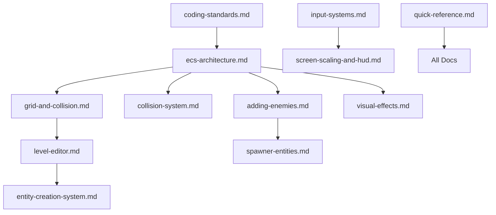

# Documentation Index for AI Assistants

## How to Use This Documentation

This index provides a comprehensive map of the Dodging Bullets codebase documentation. As an AI assistant, you should:

1. **Start here** to understand what documentation exists
2. **Use the summaries** to determine which files are relevant to the user's question
3. **Reference specific docs** for detailed information on particular topics
4. **Check relationships** to understand how different systems interact

## Quick Navigation

### Getting Started
- **README.md** - Project overview, setup, deployment
- **coding-standards.md** - MANDATORY reading for all code changes
- **quick-reference.md** - Common tasks and troubleshooting

### Core Architecture
- **ecs-architecture.md** - Entity-Component system fundamentals
- **grid-and-collision.md** - Grid system, layers, collision detection
- **collision-system.md** - Entity-to-entity collision

### Game Systems
- **input-systems.md** - Joystick, keyboard, touch controls
- **pathfinding.md** - A* pathfinding for AI
- **event-system.md** - Event-driven gameplay
- **world-state-system.md** - Save/load game progress

### Level Design
- **level-editor.md** - In-game level editor, data structure
- **level-themes.md** - Visual themes (dungeon, swamp, grass)
- **level-transitions.md** - Moving between levels
- **entity-creation-system.md** - Unified entity spawning

### Development
- **adding-enemies.md** - Complete guide for new enemy types
- **spawner-entities.md** - Entities that spawn other entities
- **visual-effects.md** - Particles, shadows, animations
- **testing.md** - Automated browser testing with Puppeteer

### Reference
- **attacker-spritesheet.md** - Player sprite frame layout
- **screen-scaling-and-hud.md** - Critical quirks for mobile
- **hud-system.md** - HUD components and positioning
- **recent-changes.md** - Latest updates

## Documentation Relationships

## File Summaries

### Critical Files (Read First)

**coding-standards.md** (43KB)
- MANDATORY build/lint workflow
- Modern JavaScript standards
- Component design principles (props pattern, no defaults)
- No magic numbers rule
- ESLint configuration

**quick-reference.md** (32KB)
- Common development tasks
- Project structure overview
- Adding assets, entities, components
- Debug controls (G, C, E, P, V, Y keys)
- Troubleshooting guide

**ecs-architecture.md** (12KB)
- Entity-Component-System fundamentals
- Component design principles
- Update order rules
- EntityManager usage

### Core Systems

**grid-and-collision.md** (18KB)
- 64x64 pixel grid system
- Multi-layer environments (layer -1, 0, 1+)
- Transition cells (staircases)
- Projectile collision rules
- Scene setup patterns

**collision-system.md** (11KB)
- Entity-to-entity collision (separate from grid)
- CollisionComponent and tags
- AABB detection with spatial partitioning
- Collision callbacks and timing

**pathfinding.md** (15KB)
- A* pathfinding implementation
- Layer-aware navigation
- Transition cell handling
- Performance considerations

**event-system.md** (6KB)
- EventManagerSystem
- Triggers and event flow
- BaseEventComponent pattern

**world-state-system.md** (5KB)
- Persistent entity destruction
- Event-spawned entity tracking
- Cell modification persistence
- Player health/coins across levels

### Level Design

**level-editor.md** (31KB)
- Level data structure (JSON format)
- Editor modes (default, grid, move, resize, texture, trigger)
- Entity placement and editing
- Saving workflow
- 47-tile path system with diagonal awareness
- Multiple path types (path, water)

**level-themes.md** (12KB)
- Theme renderers (dungeon, swamp, grass)
- Background rendering
- Wall/platform patterns
- Vignette effects

**entity-creation-system.md** (17KB)
- Unified entity array in level JSON
- Event-driven spawning (createOnAnyEvent, createOnAllEvents)
- Entity IDs and types
- EventChainer for sequential spawning

### Development Guides

**adding-enemies.md** (21KB)
- Step-by-step enemy implementation
- Asset preparation
- Component creation
- State machine setup
- Editor integration
- Distance-based AI patterns

**spawner-entities.md** (17KB)
- Proximity spawners (bug bases)
- Event-driven spawners
- Difficulty system
- Editor workflow

**visual-effects.md** (16KB)
- HitFlashComponent
- Particle effects patterns
- Shadows
- Rotating projectiles
- Complex destruction effects

**testing.md** (20KB)
- Puppeteer-based browser tests
- RemoteInputComponent for test control
- Test patterns and helpers
- Lessons learned (test isolation, no magic numbers)

### Input and Display

**input-systems.md** (11KB)
- Touch joystick (movement)
- Aim joystick (firing)
- Keyboard controls
- Momentum-based movement

**screen-scaling-and-hud.md** (8KB)
- Camera zoom must be 1
- FIT mode with 1280x720 resolution
- HUD positioning (displaySize vs game size)
- Android compatibility quirks

**hud-system.md** (4KB)
- HUD scene overlay
- Button alpha states
- Touch input handling

### Reference

**attacker-spritesheet.md** (4KB)
- Frame layout (672×672, 12×12 grid, 56×56 frames)
- Idle, punch, walk, slide animations
- Frame index mapping

## Consistency Check Results

✅ **Consistent:** ECS patterns across all component docs
✅ **Consistent:** Grid system terminology
✅ **Consistent:** Build/lint workflow mentioned consistently
⚠️ **Minor inconsistency:** Some docs mention old 16-tile path system, now 47 tiles
⚠️ **Minor inconsistency:** Water system recently added, not fully documented

## Completeness Check Results

✅ **Complete:** Core architecture well documented
✅ **Complete:** Development workflows clear
✅ **Complete:** Testing infrastructure documented
⚠️ **Gap:** Water gameplay mechanics (recently added, minimal docs)
⚠️ **Gap:** New animations (pushing, picking-up, falling-back-death) not documented
⚠️ **Gap:** Pagination in texture editor not documented

## Recommendations

1. Update level-editor.md to reflect 47-tile path system throughout
2. Add water gameplay section to quick-reference.md
3. Update attacker-spritesheet.md with new animations
4. Document texture editor pagination

---

**Next:** Creating consolidated AGENTS.md...
