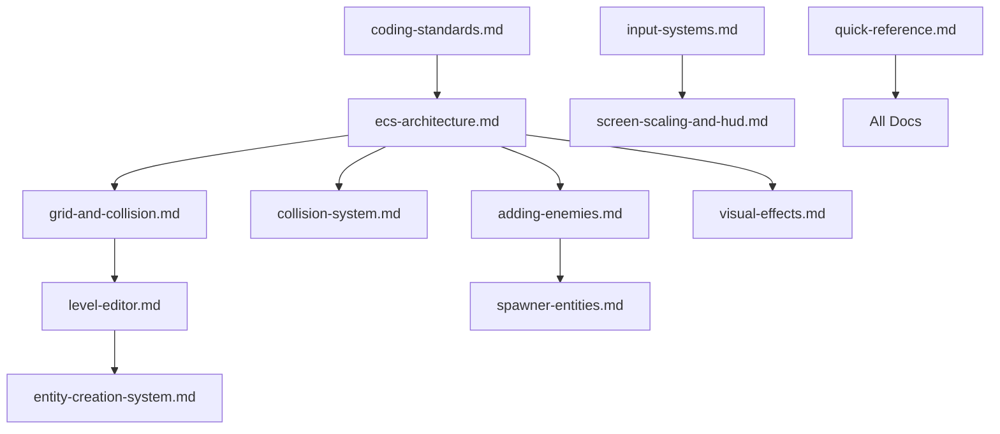

# Documentation Index for AI Assistants

## 🚨 STOP: Check for Delegation FIRST 🚨

**BEFORE doing ANYTHING, check if this request requires delegation:**

### Design Tasks → IMMEDIATELY invoke db-design agent
- "design {feature}"
- "flesh out the design"
- "create a spec"
- "I want {feature}" (if new/complex)
- "how should I implement"
- "plan out {feature}"

**DO NOT:** Read files, ask questions, or start work yourself.
**DO:** Immediately use `use_subagent` with agent_name: "db-design"

### Implementation Tasks → Check if tasks.md exists

**If tasks.md exists:**
- "implement task X.Y from features/{feature}/tasks.md"
- "implement phase X from features/{feature}/tasks.md"
- "implement all tasks from features/{feature}/tasks.md"

**DO:** Immediately use `use_subagent` with agent_name: "db-implementor"

**If no tasks.md (user says "implement it" without task reference):**
- Ask: "Should I implement this directly, or create a task breakdown first?"
- If user confirms direct implementation → Handle yourself
- If user wants task breakdown → Delegate to db-design first

**EXCEPTION - User Override:**
- "implement task X.Y directly" → Handle yourself (skip testing)
- "quick fix: {change}" → Handle yourself
- "I will be afk, keep going until this works" → Handle yourself with testing

**MANDATORY when implementing directly:**
1. ✅ **Mark tasks complete in tasks.md IMMEDIATELY after finishing each task**
2. ✅ Run tests after each major component
3. ✅ **Do NOT skip any tasks** - implement everything in tasks.md
4. ✅ **Do NOT claim completion until ALL tasks are done**
5. ✅ Update IMPLEMENTATION-COMPLETE.md when ALL tasks done
6. ✅ Document any deviations from original plan
7. ✅ Note actual vs estimated time

**CRITICAL:** If you finish Phase 1 but skip Phase 3, you have NOT completed implementation. All phases must be done.

### Asset Tasks → IMMEDIATELY invoke db-asset-management agent
- "update {enemy} spritesheet"
- "optimize assets"
- "add texture"
- "align sprites"

### Editor Tasks → IMMEDIATELY invoke db-level-editor agent
- "add editor mode"
- "add {entity} to editor"
- "fix editor {issue}"

**If you catch yourself reading files or planning work for a design/implementation/asset/editor task, STOP and delegate.**

---

## How to Use This Documentation

This index provides a comprehensive map of the Dodging Bullets codebase documentation. As an AI assistant, you should:

1. **Start here** to understand what documentation exists
2. **Use the summaries** to determine which files are relevant to the user's question
3. **Reference specific docs** for detailed information on particular topics
4. **Check relationships** to understand how different systems interact

## Quick Navigation

### Getting Started
- **README.md** - Project overview, setup, deployment
- **coding-standards.md** - MANDATORY reading for all code changes
- **quick-reference.md** - Common tasks and troubleshooting

### Core Architecture
- **ecs-architecture.md** - Entity-Component system fundamentals
- **grid-and-collision.md** - Grid system, layers, collision detection
- **collision-system.md** - Entity-to-entity collision

### Game Systems
- **input-systems.md** - Joystick, keyboard, touch controls
- **pathfinding.md** - A* pathfinding for AI
- **event-system.md** - Event-driven gameplay
- **world-state-system.md** - Save/load game progress
- **NPC system** - NPCs with interactions (see quick-reference.md and entity-creation-system.md)
- **pets-quick-ref.md** - Pet system (rock throw, dog bark, following, fear)
- **feature-design-process.md** - SOP for designing new features (10 phases)

### Level Design
- **level-editor.md** - Standalone level editor, data structure
- **level-themes.md** - Visual themes (dungeon, swamp, grass)
- **level-transitions.md** - Moving between levels
- **entity-creation-system.md** - Unified entity spawning

### Development
- **adding-enemies.md** - Complete guide for new enemy types
- **spawner-entities.md** - Entities that spawn other entities
- **visual-effects.md** - Particles, shadows, animations
- **testing.md** - Automated browser testing with Puppeteer

### Reference
- **attacker-spritesheet.md** - Player sprite frame layout
- **screen-scaling-and-hud.md** - Critical quirks for mobile
- **hud-system.md** - HUD components and positioning

## Documentation Relationships

```mermaid
graph TB
    A[coding-standards.md] --> B[ecs-architecture.md]
    B --> C[grid-and-collision.md]
    B --> D[collision-system.md]
    C --> E[level-editor.md]
    E --> F[entity-creation-system.md]
    B --> G[adding-enemies.md]
    G --> H[spawner-entities.md]
    B --> I[visual-effects.md]
    J[input-systems.md] --> K[screen-scaling-and-hud.md]
    L[quick-reference.md] --> M[All Docs]
```

## File Summaries

### Critical Files (Read First)

**coding-standards.md** (43KB)
- MANDATORY build after every change (lint only when asked or before committing)
- Modern JavaScript standards
- Component design principles (props pattern, no defaults)
- No magic numbers rule
- ESLint configuration

**quick-reference.md** (32KB)
- Common development tasks
- Project structure overview
- Adding assets, entities, components
- Debug controls (G, C, E, M, P, V, Y, R keys)
- Troubleshooting guide

**ecs-architecture.md** (12KB)
- Entity-Component-System fundamentals
- Component design principles
- Update order rules
- EntityManager usage

### Core Systems

**grid-and-collision.md** (18KB)
- 64x64 pixel grid system
- Multi-layer environments (layer -1, 0, 1+)
- Transition cells (staircases)
- Projectile collision rules
- Scene setup patterns

**collision-system.md** (11KB)
- Entity-to-entity collision (separate from grid)
- CollisionComponent and tags
- AABB detection with spatial partitioning
- Collision callbacks and timing

**pathfinding.md** (15KB)
- A* pathfinding implementation
- Layer-aware navigation
- Transition cell handling
- Performance considerations

**event-system.md** (6KB)
- EventManagerSystem
- Triggers and event flow
- BaseEventComponent pattern

**world-state-system.md** (5KB)
- Persistent entity destruction
- Event-spawned entity tracking
- Cell modification persistence
- Player health/coins/direction across levels

### Level Design

**level-editor.md** (31KB)
- Level data structure (JSON format)
- Editor tools (level, state, select, grid, entity)
- Entity placement and editing
- Saving workflow (direct to disk via dev server)
- Split architecture (HTML panels + Phaser canvas)
- Keyboard shortcuts and navigation

**level-themes.md** (12KB)
- Theme renderers (dungeon, swamp, grass, wilds, tunnels)
- Background rendering, overlays, spritesheets
- Wall/platform patterns
- Vignette effects

**level-transitions.md** (3KB)
- Exit triggers and bidirectional travel
- WorldState persistence across transitions
- Player facing direction preserved across transitions

**entity-creation-system.md** (17KB)
- Unified entity array in level JSON
- Event-driven spawning (createOnAnyEvent, createOnAllEvents)
- EntityRegistry factory pattern (registerEntityFactory, getEntityFactory)
- Entity IDs and types
- EventChainer for sequential spawning

### Development Guides

**adding-enemies.md** (21KB)
- Step-by-step enemy implementation
- Asset preparation
- Component creation
- State machine setup
- Editor integration
- Distance-based AI patterns

**spawner-entities.md** (17KB)
- Proximity spawners (bug bases)
- Event-driven spawners
- Difficulty system
- Editor workflow

**visual-effects.md** (16KB)
- HitFlashComponent
- Particle effects patterns
- Shadows
- Rotating projectiles
- Complex destruction effects

**testing.md** (20KB)
- Puppeteer-based browser tests
- RemoteInputComponent for test control
- Test patterns and helpers
- Lessons learned (test isolation, no magic numbers)

### Input and Display

**input-systems.md** (11KB)
- Touch joystick (movement)
- Aim joystick (firing)
- Keyboard controls
- Momentum-based movement

**screen-scaling-and-hud.md** (8KB)
- Camera zoom must be 1
- EXPAND mode with 1280x720 resolution (16:9 landscape)
- HUD positioning (displaySize vs game size)
- Android compatibility quirks
- Landscape orientation lock in AndroidManifest.xml

**hud-system.md** (4KB)
- HUD scene overlay
- Button alpha states
- Touch input handling

### Reference

**attacker-spritesheet.md** (4KB)
- Frame layout (672×672, 12×12 grid, 56×56 frames)
- Idle, punch, walk, slide animations
- Frame index mapping

## Consistency Check Results

✅ **Consistent:** ECS patterns across all component docs
✅ **Consistent:** Grid system terminology
✅ **Consistent:** Build/lint workflow mentioned consistently
✅ **Consistent:** All file paths verified to exist (May 2026 audit)
✅ **Consistent:** workbench/ references correct (renamed from trackers/)

## Completeness Check Results

✅ **Complete:** Core architecture well documented
✅ **Complete:** Development workflows clear
✅ **Complete:** Testing infrastructure documented
✅ **Complete:** Water gameplay mechanics documented in quick-reference.md
✅ **Complete:** Pet system (rock throw, dog bark) documented in pets-quick-ref.md
✅ **Complete:** Companion system documented in quick-reference.md
✅ **Complete:** Punch charge/release animation fix documented
✅ **Complete:** Workbench dashboard (new session, commit all, update docs) documented
✅ **Complete:** Dual development system (Kiro + Claude Code) documented
✅ **Complete:** Agent SOPs documented (ChatGPT prompts, attacker spritesheet, background textures)
✅ **Complete:** Session redesign documented (chat UI, message persistence, WebSocket, idle management, rooms)
✅ **Complete:** Regression test suite documented (combat, flags, health, player, triggers, loading, pets)

## Dual Development System

This project supports both **Kiro** and **Claude Code** for AI-assisted development:
- **Kiro sessions**: `kiro-cli chat --agent dodging-bullets` (orchestrator with sub-agents)
- **Claude Code sessions**: `claude` (picks up context from `CLAUDE.md` in project root)
- Both managed via the VS Code extension (DB Sessions sidebar) or `workbench/sessions.html`
- Session type shown by icon in the sidebar
- `scripts/extract-sessions.mjs` reads both kiro and claude session histories for doc updates

**`CLAUDE.md`** — Compact project context file for Claude Code (tech stack, architecture, coding standards, key patterns). Kept in sync with docs manually.

## Agent SOPs

`agent-sops/` contains Standard Operating Procedures that agents read on demand:
- `creating-chatgpt-image-prompts.md` — How to write effective image-gen prompts for game props (trigger phrases: "help me create a chatgpt prompt", "image prompt for", etc.)
- `updating-attacker-spritesheet.md` — SOP for regenerating the player spritesheet
- `adding-background-textures.md` — SOP for adding new cell textures

## Project Trackers

All trackers live in `workbench/` folder:
- `workbench/main.html` — Dashboard with New Session, Commit All, Update Docs buttons
- `workbench/sessions.html` — Chat-based session manager (room tabs, message history, compose box, WebSocket streaming, idle management)
- `workbench/architecture-issues.html` — Tech debt tracker
- `workbench/bug-tracker.html` — Bug tracker
- `workbench/feature-tracker.html` — Feature tracker
- `workbench/linter-errors.html` — Linter errors tracker (fetches from `GET /api/lint`, categorizes by rule)

Interactive when dev server running. API endpoints in `vite.config.ts`.

Session management redesigned (KiRoom-inspired): chat-based UI with compose box + rendered message history replaces raw terminal iframes. Messages persisted in `.session-data/`. WebSocket streaming (`/ws/sessions`) for real-time output. Idle management (10min auto-idle, transparent resume). Room organization via pill tabs. Session recovery deduplicates tagged sessions and drops stale entries. Workflow sessions are singletons via tag-based auto-replacement (`workflow:*`, `fix:*`). `cleanup-dead` endpoint + 🧹 button for bulk dead-session removal. New APIs: `/{id}/messages`, `/{id}/send`, `/{id}/resume`, `/update`, `/cleanup-dead`. VS Code extension (`vscode-sessions/`) provides alternative access via integrated terminals with native copy/paste. See `docs/README.md` § Session Management.

## Recent Architecture Changes (May 2026)

- **EntityRegistry pattern**: EntityLoader refactored from 798 LOC with 22-case switch to 220 LOC orchestrator. New `src/systems/EntityRegistry.ts` (factory registry) and `src/systems/entityFactories.ts` (all registrations via side-effect import, delegates to `src/systems/entity-factories/`). Adding new entity types no longer requires modifying EntityLoader — just register a factory
- **Entity factory subdirectory**: `src/systems/entity-factories/enemyFactories.ts`, `gameplayFactories.ts`, `levelFactories.ts` — domain-specific factory registrations
- **GridMovementValidator**: Extracted from GridCollisionComponent (423→221 LOC). `src/ecs/components/movement/GridMovementValidator.ts` isolates collision logic (canMoveTo, layer checks) from position tracking
- **currentCell uses entity center**: `GridCollisionComponent` computes `currentCell` from the entity's transform position (center X via collision box offsetX, Y via `transform.y`). Using the entity center rather than the collision box center ensures symmetric cell transitions in all directions. `currentLayer` still uses collision box center (feet position) since layer determines collision rules.
- **ComponentStateMachine**: New lightweight state machine (`src/systems/state/ComponentStateMachine.ts`) for internal component states. Dispatches to handler functions instead of full IState classes. Used by `PetFollowComponent`, `DogBarkAbility`, `EscortComponent`, `AttackComboComponent` — replacing inline switch/if-else state dispatch
- **GameSceneRenderer split**: Extracted `EdgeRenderer`, `ShadowRenderer`, `PathRenderer`, `BackgroundTextureRenderer` from base class. GameSceneRenderer now orchestrates these focused classes (~572 LOC down from ~1219)
- **JumpComponent split**: Extracted `JumpDetector` (detection logic) and `JumpAnimator` (animation phases) from JumpComponent. Orchestrator is now ~103 LOC, total ~604 LOC across 3 files
- **GridDebugRenderer**: Extracted from `Grid.ts` — all debug visualization logic in `src/systems/grid/GridDebugRenderer.ts`
- **EscortCrouchBehavior**: Knight crouch/shiver logic extracted from `EscortComponent` into `src/ecs/components/escort/EscortCrouchBehavior.ts`
- **EscortPathfinding**: Path-following and destination movement logic extracted from `EscortComponent` into `src/ecs/components/escort/EscortPathfinding.ts`
- **PetSyncJumpBehavior**: Sync-jump logic extracted from `PetFollowComponent` into `src/ecs/components/pet/PetSyncJumpBehavior.ts`
- **WorldFlags constants**: `src/constants/WorldFlags.ts` — typed flag name constants to prevent typos. Migrated 9 call sites from raw strings.
- **CachedFlag pattern**: `src/systems/state/CachedFlag.ts` — caches a boolean WorldState flag and refreshes via `WorldStateManager.subscribeFlag()`. Now supports an optional `FlagPredicate` parameter (default treats `'true'` as true; `LaserBeamComponent` uses `(v) => v !== 'false'` for its on/off flag). Used in 7 hot-path components (JumpComponent, GridMovementValidator, AttackButtonComponent, AttackComboComponent, PlayerStateHelpers, LaserBeamComponent, LeverComponent) to eliminate per-frame singleton lookups.
- **WorldStateManager API additions**: `isFlagTrue(name)` (type-safe boolean), `subscribeFlag(name, cb)` (returns unsubscribe; fires on `setFlag` + `loadFromJSON`).
- **LevelTransitionManager**: `src/systems/LevelTransitionManager.ts` — owns `start()` (save state + fade + LoadingScene handoff) and `reload()` (restore entry snapshot, preserving active escort). GameScene's `startLevelTransition` and `reloadCurrentLevel` are now 1-line delegators.
- **Grid.getFirstEntityWithTag()**: Zero-allocation helper on `Grid` / `GridReader`. Used by `TriggerComponent` and `HoleComponent` instead of `getEntitiesWithTag(...)[0]`.
- **Rarity constants**: `src/constants/Rarity.ts` — extracted `Rarity` type and drop chance tables (`RARITY_COIN_COUNTS`, `RARITY_MEDIPACK_CHANCE`, `RARITY_SMALL_MUSHROOM_CHANCE`)
- **Standalone editor**: Old `src/editor/` state machine removed. Editor is now a separate app at `editor/` (HTML panels + Phaser canvas). Accessed via `http://localhost:5173/editor/`
- **Lua Runtime split**: `src/systems/LuaRuntime.ts` refactored — API registration moved to `src/systems/lua-api/` (PlayerAPI, NpcAPI, WorldAPI, UIAPI, types)
- **Rock Throw state pattern**: `RockThrowAbility` delegates to state classes in `src/ecs/components/pet/rock-throw/`
- **Water entry/exit**: Uses `JumpComponent.triggerWaterJump()` instead of custom hop animation in WaterEffectComponent
- **Session management**: Multi-session tmux+ttyd system in `vite.config.ts` with full CRUD API
- **canPush flag**: Pushing requires WorldState flag `canPush` = `"true"` (obtained from root_chest with `push_strength` item)
- **Platform pushing**: Pushables can be pushed off platforms with gravity fall to lower layer
- **Punch animation fix**: `wasPunching` flag in PlayerIdleState/PlayerWalkState force-replays idle/walk animation after punch
- **zOffsetOverride**: Background texture `zOffsetOverride` is now an absolute depth value (not offset). Positive values render in front of player. Editor has Z Override checkbox.
- **alphaBlend 'tiny'**: New overlay opacity level (0.2-0.25) for barely-visible overlays
- **Overlay tint/scale properties**: `tint` (hex color), `tintVariation` (random hue shift), `scale` (base scale), `scaleVariation` (random size variation)
- **Overlay blend modes**: Added `'screen'` (lighten) and `'add'` (additive glow) to existing `'normal'`/`'multiply'`
- **Background rendering options**: `floorAlpha` (floor opacity), `hasEdges` (disable edge lines), `hasShadows` (disable shadows), `edgeDarkening` (vignette-like edge darkening)
- **SoundManager injection**: Components receive SoundManager via props instead of calling `getInstance()` internally. Entity factories call `getInstance()` and pass through
- **Per-texture visual options**: Background textures support `blendMode`, `alpha`, and `tint` fields (rendered by `BackgroundTextureRenderer`). Editor exposes these in the cell texture form.
- **Overlay placementStrategy 'random'**: Fixed to use uniform distribution across all eligible cells (no edge bias)
- **Water texture edges**: `water_texture_edges` field in background config — renders edge overlay above water tiles at depth -9 (used by grass_overworld themes for clean water/land transitions)
- **Small mushroom drops**: Breakables can now drop small mushrooms (instant 20 HP heal, 40px collection distance, 300ms spawn delay, 15s lifetime with fade). Drop chance scales with rarity. Key files: `src/ecs/entities/pickup/SmallMushroomEntity.ts`, `src/ecs/components/pickup/SmallMushroomComponent.ts`
- **Enemy health drops**: Enemies drop small mushrooms on death with per-type chances (skeleton 20%, puma 25%, red_skeleton 20%, bug 10%, thrower 5%). Uses `HealthDropOnDeathComponent` added in enemy factories.
- **grass_overworld1 theme**: Alias for `grass` theme (uses same `GrassSceneRenderer`). Registered in `ThemeRendererFactory.ts` and `LevelTheme` type.
- **Linter errors tracker**: `workbench/linter-errors.html` — fetches lint results from `GET /api/lint`, categorizes by rule, allows fixing via kiro agent sessions
- **Session delete**: Sessions can be permanently deleted (removes from disk). Workflows (tagged sessions) have no edit/archive buttons — only delete
- **Session diff viewer**: Collapsible panel in `workbench/sessions.html` showing `git diff` output per-file. Uses `GET /api/git/diff` endpoint. Explorer tab removed (was redundant with VS Code).
- **Copy mode**: Click 📋 button on active sessions to capture terminal content (last 500 lines via tmux `capture-pane`). Text displayed in selectable panel for Cmd+C copying. Uses `POST /api/sessions/capture` endpoint.
- **Coding standards — complexity/nesting**: New section in `docs/coding-standards.md` covering cyclomatic complexity ≤15, max nesting depth ≤4, nullish coalescing, no nested ternaries, no negated conditions with else.
- **VS Code sessions extension**: `vscode-sessions/` — Opens sessions in VS Code integrated terminals (native copy/paste). Shares `.sessions.json` with web UI. Install: `cd vscode-sessions && npx tsc -p ./ && npx @vscode/vsce package --allow-missing-repository && code --install-extension db-sessions-0.1.0.vsix`
- **Grid.getEntitiesWithTag optimization**: Uses `tagIndex` (Map<string, Set<Entity>>) with ref-counting for O(1) lookup instead of O(rows×cols) full scan. An entity occupying multiple cells is only added to the tag index once and removed when its last cell occupancy is cleared.
- **Cross-nav links**: All workbench tracker pages have "← Back to Trackers" link at top for navigation between pages.
- **Water sprite masking**: Player sprite is clipped at the water edge boundary so the lower body doesn't render below the water surface. Mask updates when player moves to a new cell. Implemented in `WaterEffectComponent.updateSpriteMask()`.
- **Tracker refresh buttons**: All workbench tracker pages (architecture-issues, bug-tracker, feature-tracker) have a refresh button that reloads the page to pick up changes from other sessions.
- **Fixed camera levels**: New `fixedCamera` field in LevelData (`{ centerCol, centerRow }`). Camera centers on specified cell and stays fixed instead of following the player. Editor: Level Info panel has Fixed Camera checkbox + center col/row inputs. Implementation in `GameScene.ts` (camera update) and `LevelLoader.ts` (type definition).
- **Loading screen image**: BootScene shows `Loading.png` background during initial load. Title background and music load asynchronously during the loading screen (minimum 1000ms display time before transitioning to title).
- **Editor paint tool**: Freehand painting directly on level canvas. Paint saved as `{levelName}_paint.png` alongside level JSON. Controls: drag to paint, shift+click for straight lines, color/alpha/size sliders, eraser mode. Renders at `Depth.edgeGraphics + 1` via `PaintRenderer`. API: `/api/paint` (GET), `/api/save-paint` (POST). Key files: `src/scenes/theme/PaintRenderer.ts`, `editor/EditorBridge.ts` (paint canvas), `editor/CanvasInteraction.ts` (input), `editor/panels/Toolbar.ts` (UI).
- **Editor undo/redo**: Ctrl+Z / Ctrl+Shift+Z now functional. Snapshots level state before every mutation (max 50 entries). Restores snapshot by restarting scene with preserved camera position/zoom. Undo/Redo buttons also in Paint panel.
- **Small mushroom no-overheal**: `SmallMushroomComponent` now caps healing at max health — no overheal from small mushrooms (previously healed unconditionally).
- **Level music system**: Levels can specify `"music": "<asset_key>"` in their JSON to play background music. `MusicManager` (`src/systems/MusicManager.ts`) singleton tracks the current key — same key across consecutive levels = no-op (seamless), different key = stop+swap, `null`/omitted = stop. `BootScene` plays `btr_music` (title) via `MusicManager`; `GameScene.createGameScene()` calls `MusicManager.play(this, levelData.music ?? null)` after `preloadLevelAssets` + `waitForLoad()`. Music asset is loaded per-level via `AssetManifest.fromLevelData` (LoadingScene path) and `preloadLevelAssets` (skip-boot path). `SoundManager` skips `assets/music/*` paths from the Android native SoundPool preload — music streams via Phaser instead. Registered keys: `btr_music`, `btr_overworld`, `btr_wilds`, `btr_tonal`.
- **Trigger blocking**: `TriggerComponent` now skips trigger cells occupied by a `GridCellBlocker` (pushables, breakables, root chests). Prevents triggers from firing when the player can't actually reach the cell. Documented in `docs/event-system.md`.
- **Water entry from south blocked**: `GridMovementValidator` checks the visual-center cell when moving north — if it's water and `canSwim` is false, movement is blocked. Without this, the player's collision box (offset south of the visual sprite) could walk onto water from below. Documented in `docs/quick-reference.md` Water System section.
- **EnemyTargeting utility**: `findNearestEntityInFOV` extracted to `src/utils/EnemyTargeting.ts` — shared targeting logic (range + FOV cone) used by punch targeting and available for future targeting consumers.
- **HealthComponent autoheal cache**: `HealthComponent` now caches the `hasAutoHeal` flag at construction instead of polling `WorldStateManager` every frame. Call `refreshAutoHeal()` after the flag changes (e.g., after Lua sets it).
- **AttackComboComponent refactor**: `createPunchHitbox()` split into `playPunchSound()`, `resolveAimDirection()`, `spawnPunchParticles()` helpers for reduced complexity.
- **WorldStateManager array texture handling**: `scanModifiedCells` now correctly compares cells with array `backgroundTexture` (multi-texture cells), fixing a regression where modified cells were re-detected as changed every load.
- **Session redesign (2026-05-20)**: Replaced ttyd terminal iframes with chat-based UI. Messages stored in `.session-data/{sessionId}.json`. WebSocket server (`/ws/sessions`) streams tmux output to subscribed clients. Idle management: 10min inactivity → idle state (ttyd killed, tmux preserved), another 10min → full cull. Room organization: sessions assigned to rooms, pill-tab UI for filtering. Session recovery: deduplicates tagged sessions, drops dead workflows and stale (>24h) untagged sessions. New endpoints: `/{id}/messages`, `/{id}/send`, `/{id}/resume`, `/update`, `/cleanup-dead`. Feature spec: `features/session-redesign/requirements.md`.
- **Session tagging & workflow singletons (2026-05-20)**: `spawnSession` now accepts a `tag` parameter. Workflow buttons pass tags like `workflow:update-docs`, `fix:bugs-42`. When a tagged session spawns, any existing session with the same tag (or matching label fallback) is auto-killed — prevents session list bloat from repeated workflow clicks. Port collision fix: `findAvailablePort()` now checks both OS-bound ports AND ports claimed by in-memory sessions. Recovery drops sessions with port 0 (failed spawns). `cleanup-dead` endpoint and 🧹 button for bulk removal.
- **Regression test infrastructure (2026-05-20)**: New `test/interactions/` helper modules: `combat.js` (punch state, enemy health/count, waitForPunchComplete), `flags.js` (WorldState flag get/set/wait, CachedFlag sync), `state.js` (player state machine, health, death, water detection), `hud.js` (joystick visuals), `input.js` (low-level joystick touch simulation). New test levels: `test-combat.json`, `test-punch-damage.json`, `test-push.json`, `test-jump.json`. New globals exposed in test mode: `WorldStateManager`, `AttackComboComponent`, `HealthComponent`, `WalkComponent`, `StateMachineComponent`, `WaterEffectComponent`, `CachedFlag`, `PushableComponent`, `JumpComponent`. Test files: `test-combat.js` (canPunch flag gating), `test-punch-damage.js` (punch damage to enemies), `test-cached-flag-load.js` (CachedFlag loadFromFile regression), `test-flag-gating.js` (all ability flags), `test-push.js` (push block mechanics), `test-jump.js` (jump across gaps). Feature spec in `features/regression-tests/`. Motivation: CachedFlag migration caused a punch regression — tests now catch flag-gating bugs.
- **btr_tonal music (2026-05-21)**: New music key `btr_tonal` registered in AssetRegistry. Registered keys now: `btr_music`, `btr_overworld`, `btr_wilds`, `btr_tonal`.
- **Editor music save fix (2026-05-21)**: Music dropdown added to Level Info panel in editor (`editor/panels/ContextPanel.ts`). Options: (none), btr_music, btr_overworld, btr_wilds, btr_tonal. `EditorBridge.ts` now preserves `music` field when saving level JSON (was previously stripped on save). Changing music marks level as dirty.
- **Regression tests completed (2026-05-21)**: Super punch test (`test/tests/combat/test-super-punch.js`), walking punch test (`test/tests/combat/test-punch-while-moving.js`), water/swim test (`test/tests/player/test-swim.js`), triggers test (`test/tests/triggers/test-triggers.js`), gameplay loop smoke test (`test/tests/combat/test-gameplay-loop.js`). New test levels: `test-super-punch.json`, `test-swim.json`, `test-triggers.json`, `test-gameplay-loop.json`. Feature tracker tasks updated in `features/regression-tests/tasks.md`.
- **Architecture review (2026-05-18)**: Scanner: 20 files / 9212 LOC / 60 issues (3 critical, 19 high, 23 medium, 15 low). 6 new issues added (#54-#59): CachedFlag half-migration (LaserBeam/Lever still poll), worldToCellInto adoption stalled (13 hot-path sites), PlayerProximityChecker missing abstraction, LaserBeamComponent raycast allocation, LuaRuntime SpecialItemDisplay extraction, EnemyIndex hardcoding. Verdict: architecture fundamentally sound, main action is enforcing existing patterns.
- **Zero-alloc grid coordinates (2026-05-20)**: `Grid.cellToWorldInto(col, row, out)` added to mirror the existing `worldToCellInto`. The `Into` variants are now used by 12 hot-path files (JumpAnimator, GridCollisionComponent, KnockbackComponent, JumpDetector, GridMovementValidator, WalkComponent, WaterEffectComponent, WaterRippleComponent, PetFollowComponent, PetSyncJumpBehavior, RockArcComponent, BugChaseState). Each component holds private scratch `CellCoord`/`WorldCoord` fields and reuses them across frames — eliminates per-frame allocations in movement/collision/jump code paths. Resolves architecture issue #55 (worldToCellInto adoption stalled).
- **CachedFlag full migration (2026-05-20)**: `LaserBeamComponent` and `LeverComponent` were the last hot-path consumers still polling `WorldStateManager.getFlag()` every frame. Both now use `CachedFlag` — laser uses a custom predicate (`v !== 'false'`) to preserve "on by default" semantics, lever caches the `_locked` flag for one-shot levers. `CachedFlag` constructor now accepts an optional `FlagPredicate` arg. Resolves architecture issue #54.
- **New background textures (2026-05-20)**: `crumbled_cottage`, `abandoned_hut`, `shrine` PNGs added to `public/assets/cell_drawables/`, registered in `AssetRegistry`, added to the `editor` asset group, and listed in `BACKGROUND_TEXTURE_KEYS`. The `agent-sops/adding-background-textures.md` SOP was rewritten — old version referenced files that no longer exist (`src/editor/TextureEditorState.ts`, `AVAILABLE_TEXTURES`, `BACKGROUND_TEXTURE_TRANSFORM_OVERRIDES`).
- **ChatGPT image prompt SOP overhaul (2026-05-20)**: `agent-sops/creating-chatgpt-image-prompts.md` rewritten with a SNES Zelda-style template, 10 core rules, structured PERSPECTIVE/VISUAL STYLE/LIGHTING/RENDERING/CANVAS sections, INCLUDE/EXCLUDE detail slots, and emphasis on "gameplay assets, NOT illustrations" — with strongest universal phrases like "DESIGNED TO SIT DIRECTLY ON A TILEMAP" and "VIEWED DIRECTLY FROM ABOVE". Updated example output (faded bush) to match the new template.
- **Pet jump position fix (2026-05-22)**: Fixed bug where pet snapped back to pre-jump position after platform/void jumps. Root cause: `GridCollisionComponent` wasn't synced to the pet's new position after the jump tween completed. Fix: `PetSyncJumpBehavior.finishJump()` now calls `gridCollision.syncPreviousPosition(transform.x, transform.y)` after re-enabling collision. Same pattern applied in `PetFollowComponent` when exiting water (riding → idle transition).
- **Path edge blending and scatter (2026-05-22)**: `PathRenderer` now renders multi-pass alpha gradient around path edges (softens path into surrounding floor). `PathTilesetGenerator` adds random jagged scatter particles along path edges for natural stone-to-dirt transition. Constants: `EDGE_BLEND_WIDTH_PX = 5`, `EDGE_SCATTER_DENSITY = 0.5`, `EDGE_SCATTER_MAX_SIZE_PX = 2`.
- **New background textures (2026-05-22)**: `dead_tree2`, `stone_wall2`, `water_poison` added to `public/assets/cell_drawables/`, registered in `AssetRegistry`, added to `editor` asset group and `BACKGROUND_TEXTURE_KEYS`. Note: `dead_tree3` is registered in `AssetRegistry` but the PNG file does not exist yet.
- **Dynamic Z for background textures (2026-05-24)**: New `dynamicZ` boolean field on `BackgroundTextureConfig`. When set, `BackgroundTextureRenderer.updateDynamicZ(playerY)` flips the sprite's depth each frame: renders in front of player when player is above the sprite's Y, behind when below. Editor: Dynamic Z checkbox in ContextPanel. `GameSceneRenderer.update()` passes playerY to the background texture renderer.
- **Pet void-fall respawn fix (2026-05-24)**: After a void fall, pet now teleports to the player's feet cell (via `getPlayerFeetCell()`) instead of the original jump target — prevents pet spawning on void cells. Test consolidated: `test-pet-jump-snapback.js` merged into `test-pet-jump.js`.
- **Test-first bug fix workflow (2026-05-24)**: Added to `CLAUDE.md` and `docs/testing.md`. When fixing bugs, always write a failing test first, confirm it fails, then fix. Learned from pet jump fix where multiple blind attempts failed until a reproducing test was written.
- **Pet fall/void tests (2026-05-25)**: New test files `test-pet-fall-respawn.js`, `test-pet-platform-fall.js`, `test-pet-void-escape.js` in `test/tests/pets/`. New test levels `test-fall-jump.json`, `test-platform-fall.json` in `public/levels/test/`. Cover pet behavior during void falls, platform drops, and respawn positioning.
- **Pet layer sync removed (2026-05-25)**: `PetFollowComponent.syncPetLayer()` is now a no-op. Pet's layer is determined by `GridCollisionComponent` from the actual cell it occupies. `PetSyncJumpBehavior.finishJump()` reads the landing cell's layer directly. Old behavior (syncing from player) caused collision failures when player's layer was stale after platform jumps.
- **Pet void escape safety net (2026-05-25)**: `PetFollowComponent.update()` checks if pet is on a void cell each frame — if so, immediately teleports to the player's feet cell. Prevents pet getting stuck on void after edge-case jump landings.
- **Negative transform scale = flip (2026-05-25)**: `BackgroundTextureRenderer` now uses `Math.abs(scaleX/scaleY)` for sizing and `setFlip()` for negative values. Negative `scaleX` flips horizontally, negative `scaleY` flips vertically. Works for both static images and animated textures.
- **New test globals (2026-05-25)**: `AnimationComponent`, `PetFollowComponent`, `PetManager`, `LevelExitComponent` added to test-mode globals in `src/main.ts`.
- **Pet water ride direction fix (2026-05-25)**: `PetFollowComponent` now syncs direction from the player when entering water AND updates direction before calculating ride offset — fixes floating/misaligned pet sprite during swimming.
- **Session stability fix (2026-05-25)**: All `execSync` calls in `vite.config.ts` session management now have timeouts (2-5s). Tmux `set-option` calls (mouse, history-limit) use fire-and-forget `spawn().unref()` instead of blocking. Fixes bug where clicking "fix a bug" button killed the sessions window.
- **Player direction preservation (2026-05-25)**: `LevelTransitionManager.start()` saves player facing direction via `WorldStateManager.setPlayerSpawnDirection(walk.lastDir)`. `GameScene` restores it on spawn. Direction persists across level transitions and in save files.
- **Pet blocked area wander fix (2026-05-25)**: `PetFollowComponent` rejects wander targets on walls, blocked areas, and cells on a different layer. `BlockedAreaManager.isPointBlocked()` and `Grid.isPointBlocked()` added for point-in-blocked-area queries.
- **VignetteHealthComponent autoHeal guard (2026-05-26)**: Red vignette overlay only pulses when `hasAutoHeal` flag is active. Uses `HealthComponent.getHasAutoHeal()` which caches the flag at construction.
- **Editor music save fix (2026-05-26)**: Music dropdown added to Level Info panel. `EditorBridge.ts` preserves `music` field when saving level JSON (was previously stripped on save). Options: (none), btr_music, btr_overworld, btr_wilds, btr_tonal.
- **Claude Code skills/hooks (2026-05-26)**: Skills in `.claude/skills/`: `add-texture`, `new-level`, `run-test`, `run-all-tests`, `chatgpt-prompt`. Hooks in `.claude/hooks/`: `validate-level-json.sh` (validates level JSON structure on save).
- **New background textures (2026-05-26)**: `dead_tree2`, `stone_wall2` added to `public/assets/cell_drawables/`. `rocks_spritesheet2` and `roots_spritesheet2` added with sub-sprite definitions in `editor/SpritesheetTextures.ts`. Note: `dead_tree3` is registered in `AssetRegistry` and editor group but PNG file does not exist yet.
- **Vite level JSON middleware (2026-05-26)**: Dev server now serves level JSON directly from disk (prevents SPA fallback returning HTML for new levels that don't exist yet — fixes the `grass_overworldnnw` "not valid JSON" bug).
- **EditorScene extraction (2026-05-26)**: GameScene no longer handles editor mode. New `src/scenes/EditorScene.ts` (dedicated Phaser scene, ~260 LOC) owns all editor rendering — level load, theme setup, entity spawning for editor, paint loading. `editor/main.ts` registers and starts `EditorScene` directly instead of `GameScene` with `editorMode` flag. GameScene lost ~150 LOC of editor branches (`createEditorScene`, `createEditorPlayer`, `isEditorMode` field, editor guards in `create`/`update`/`initializeFadeIn`/`initializeCameraFollow`). Resolves architecture issue #70.
- **AnimationSystem.playIfChanged (2026-05-26)**: New convenience method on `AnimationSystem` — plays animation only if key differs from current. Replaces duplicated `if (key !== currentKey) play(key)` private helpers in `EscortComponent` and `PetFollowComponent`. Resolves architecture issue #69.
- **EntityManager.getByTag (2026-05-26)**: Zero-allocation tag query returning a `ReadonlySet<Entity>`. Tags indexed at `add()` time via internal `tagIndex: Map<string, Set<Entity>>`. `refreshEntityTags(entity)` re-syncs after dynamic tag changes. GameScene's `getEnemies` lambda now uses `entityManager.getByTag('enemy')` instead of chaining 3× `getByType()` calls. `LaserBeamComponent.checkEnemyCollision` also migrated. Resolves architecture issues #59 and #73.
- **Bell entity (2026-05-28)**: New `bell` entity type. Punchable bell that swings with damped oscillation (25° amplitude, 2.5s), emits 3 expanding shockwave rings, swaps to cracked sprite at 60% progress, and raises `{levelName}_{entityId}_rung` event on completion. Persists via WorldState (shows cracked on re-entry). Assets: `bell_bar`, `bell_body`, `bell_cracked`, `bell_ding` (sound). Key files: `src/ecs/entities/bell/BellEntity.ts`, `src/ecs/entities/bell/BellComponent.ts`. Registered in `gameplayFactories.ts`. Depth: `Depth.bell` (-5).
- **PlayerProximityChecker (2026-05-27)**: Zero-allocation distance/proximity utility at `src/ecs/systems/movement/PlayerProximityChecker.ts`. Configurable thresholds (teleport, follow, stop) with mutable result struct. Replaces duplicated distance-and-threshold code in `PetFollowComponent` and `EscortComponent`.