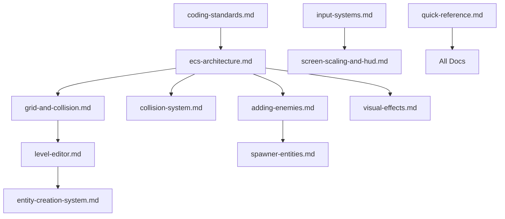

# Documentation Index for AI Assistants

## 🚨 STOP: Check for Delegation FIRST 🚨

**BEFORE doing ANYTHING, check if this request requires delegation:**

### Design Tasks → IMMEDIATELY invoke db-design agent
- "design {feature}"
- "flesh out the design"
- "create a spec"
- "I want {feature}" (if new/complex)
- "how should I implement"
- "plan out {feature}"

**DO NOT:** Read files, ask questions, or start work yourself.
**DO:** Immediately use `use_subagent` with agent_name: "db-design"

### Implementation Tasks → Check if tasks.md exists

**If tasks.md exists:**
- "implement task X.Y from features/{feature}/tasks.md"
- "implement phase X from features/{feature}/tasks.md"
- "implement all tasks from features/{feature}/tasks.md"

**DO:** Immediately use `use_subagent` with agent_name: "db-implementor"

**If no tasks.md (user says "implement it" without task reference):**
- Ask: "Should I implement this directly, or create a task breakdown first?"
- If user confirms direct implementation → Handle yourself
- If user wants task breakdown → Delegate to db-design first

**EXCEPTION - User Override:**
- "implement task X.Y directly" → Handle yourself (skip testing)
- "quick fix: {change}" → Handle yourself
- "I will be afk, keep going until this works" → Handle yourself with testing

**MANDATORY when implementing directly:**
1. ✅ **Mark tasks complete in tasks.md IMMEDIATELY after finishing each task**
2. ✅ Run tests after each major component
3. ✅ **Do NOT skip any tasks** - implement everything in tasks.md
4. ✅ **Do NOT claim completion until ALL tasks are done**
5. ✅ Update IMPLEMENTATION-COMPLETE.md when ALL tasks done
6. ✅ Document any deviations from original plan
7. ✅ Note actual vs estimated time

**CRITICAL:** If you finish Phase 1 but skip Phase 3, you have NOT completed implementation. All phases must be done.

### Asset Tasks → IMMEDIATELY invoke db-asset-management agent
- "update {enemy} spritesheet"
- "optimize assets"
- "add texture"
- "align sprites"

### Editor Tasks → IMMEDIATELY invoke db-level-editor agent
- "add editor mode"
- "add {entity} to editor"
- "fix editor {issue}"

**If you catch yourself reading files or planning work for a design/implementation/asset/editor task, STOP and delegate.**

---

## How to Use This Documentation

This index provides a comprehensive map of the Dodging Bullets codebase documentation. As an AI assistant, you should:

1. **Start here** to understand what documentation exists
2. **Use the summaries** to determine which files are relevant to the user's question
3. **Reference specific docs** for detailed information on particular topics
4. **Check relationships** to understand how different systems interact

## Quick Navigation

### Getting Started
- **README.md** - Project overview, setup, deployment
- **coding-standards.md** - MANDATORY reading for all code changes
- **quick-reference.md** - Common tasks and troubleshooting

### Core Architecture
- **ecs-architecture.md** - Entity-Component system fundamentals
- **grid-and-collision.md** - Grid system, layers, collision detection
- **collision-system.md** - Entity-to-entity collision

### Game Systems
- **input-systems.md** - Joystick, keyboard, touch controls
- **pathfinding.md** - A* pathfinding for AI
- **event-system.md** - Event-driven gameplay
- **world-state-system.md** - Save/load game progress
- **NPC system** - NPCs with interactions (see quick-reference.md and entity-creation-system.md)
- **pets-quick-ref.md** - Pet system (rock throw, dog bark, following, fear)
- **feature-design-process.md** - SOP for designing new features (10 phases)

### Level Design
- **level-editor.md** - Standalone level editor, data structure
- **level-themes.md** - Visual themes (dungeon, swamp, grass)
- **level-transitions.md** - Moving between levels
- **entity-creation-system.md** - Unified entity spawning

### Development
- **adding-enemies.md** - Complete guide for new enemy types
- **spawner-entities.md** - Entities that spawn other entities
- **visual-effects.md** - Particles, shadows, animations
- **testing.md** - Automated browser testing with Puppeteer

### Reference
- **attacker-spritesheet.md** - Player sprite frame layout
- **screen-scaling-and-hud.md** - Critical quirks for mobile
- **hud-system.md** - HUD components and positioning

## Documentation Relationships

```mermaid
graph TB
    A[coding-standards.md] --> B[ecs-architecture.md]
    B --> C[grid-and-collision.md]
    B --> D[collision-system.md]
    C --> E[level-editor.md]
    E --> F[entity-creation-system.md]
    B --> G[adding-enemies.md]
    G --> H[spawner-entities.md]
    B --> I[visual-effects.md]
    J[input-systems.md] --> K[screen-scaling-and-hud.md]
    L[quick-reference.md] --> M[All Docs]
```

## File Summaries

### Critical Files (Read First)

**coding-standards.md** (43KB)
- MANDATORY build/lint workflow
- Modern JavaScript standards
- Component design principles (props pattern, no defaults)
- No magic numbers rule
- ESLint configuration

**quick-reference.md** (32KB)
- Common development tasks
- Project structure overview
- Adding assets, entities, components
- Debug controls (G, C, E, M, P, V, Y, R keys)
- Troubleshooting guide

**ecs-architecture.md** (12KB)
- Entity-Component-System fundamentals
- Component design principles
- Update order rules
- EntityManager usage

### Core Systems

**grid-and-collision.md** (18KB)
- 64x64 pixel grid system
- Multi-layer environments (layer -1, 0, 1+)
- Transition cells (staircases)
- Projectile collision rules
- Scene setup patterns

**collision-system.md** (11KB)
- Entity-to-entity collision (separate from grid)
- CollisionComponent and tags
- AABB detection with spatial partitioning
- Collision callbacks and timing

**pathfinding.md** (15KB)
- A* pathfinding implementation
- Layer-aware navigation
- Transition cell handling
- Performance considerations

**event-system.md** (6KB)
- EventManagerSystem
- Triggers and event flow
- BaseEventComponent pattern

**world-state-system.md** (5KB)
- Persistent entity destruction
- Event-spawned entity tracking
- Cell modification persistence
- Player health/coins across levels

### Level Design

**level-editor.md** (31KB)
- Level data structure (JSON format)
- Editor tools (level, state, select, grid, entity)
- Entity placement and editing
- Saving workflow (direct to disk via dev server)
- Split architecture (HTML panels + Phaser canvas)
- Keyboard shortcuts and navigation

**level-themes.md** (12KB)
- Theme renderers (dungeon, swamp, grass, wilds, tunnels)
- Background rendering, overlays, spritesheets
- Wall/platform patterns
- Vignette effects

**level-transitions.md** (8KB)
- Exit triggers and level switching
- WorldState persistence across transitions
- Asset loading/unloading
- Runtime texture filtering (March 2026 fix)

**entity-creation-system.md** (17KB)
- Unified entity array in level JSON
- Event-driven spawning (createOnAnyEvent, createOnAllEvents)
- EntityRegistry factory pattern (registerEntityFactory, getEntityFactory)
- Entity IDs and types
- EventChainer for sequential spawning

### Development Guides

**adding-enemies.md** (21KB)
- Step-by-step enemy implementation
- Asset preparation
- Component creation
- State machine setup
- Editor integration
- Distance-based AI patterns

**spawner-entities.md** (17KB)
- Proximity spawners (bug bases)
- Event-driven spawners
- Difficulty system
- Editor workflow

**visual-effects.md** (16KB)
- HitFlashComponent
- Particle effects patterns
- Shadows
- Rotating projectiles
- Complex destruction effects

**testing.md** (20KB)
- Puppeteer-based browser tests
- RemoteInputComponent for test control
- Test patterns and helpers
- Lessons learned (test isolation, no magic numbers)

### Input and Display

**input-systems.md** (11KB)
- Touch joystick (movement)
- Aim joystick (firing)
- Keyboard controls
- Momentum-based movement

**screen-scaling-and-hud.md** (8KB)
- Camera zoom must be 1
- EXPAND mode with 1280x720 resolution (16:9 landscape)
- HUD positioning (displaySize vs game size)
- Android compatibility quirks
- Landscape orientation lock in AndroidManifest.xml

**hud-system.md** (4KB)
- HUD scene overlay
- Button alpha states
- Touch input handling

### Reference

**attacker-spritesheet.md** (4KB)
- Frame layout (672×672, 12×12 grid, 56×56 frames)
- Idle, punch, walk, slide animations
- Frame index mapping

## Consistency Check Results

✅ **Consistent:** ECS patterns across all component docs
✅ **Consistent:** Grid system terminology
✅ **Consistent:** Build/lint workflow mentioned consistently
✅ **Consistent:** All file paths verified to exist (May 2026 audit)
✅ **Consistent:** workbench/ references correct (renamed from trackers/)

## Completeness Check Results

✅ **Complete:** Core architecture well documented
✅ **Complete:** Development workflows clear
✅ **Complete:** Testing infrastructure documented
✅ **Complete:** Water gameplay mechanics documented in quick-reference.md
✅ **Complete:** Pet system (rock throw, dog bark) documented in pets-quick-ref.md
✅ **Complete:** Companion system documented in quick-reference.md
✅ **Complete:** Punch charge/release animation fix documented
✅ **Complete:** Workbench dashboard (new session, commit all, update docs) documented

## Project Trackers

All trackers live in `workbench/` folder:
- `workbench/main.html` — Dashboard with New Session, Commit All, Update Docs buttons
- `workbench/sessions.html` — Session manager (live list, connect/archive/kill, embedded terminal)
- `workbench/architecture-issues.html` — Tech debt tracker
- `workbench/bug-tracker.html` — Bug tracker
- `workbench/feature-tracker.html` — Feature tracker

Interactive when dev server running. API endpoints in `vite.config.ts`.

Session management via tmux + ttyd — sessions persist across tab switches, reconnect automatically. Full CRUD: create, rename, archive, unarchive, kill, reconnect, delete. See `docs/README.md` § Session Management.

## Recent Architecture Changes (May 2026)

- **EntityRegistry pattern**: EntityLoader refactored from 798 LOC with 22-case switch to 220 LOC orchestrator. New `src/systems/EntityRegistry.ts` (factory registry) and `src/systems/entityFactories.ts` (all registrations via side-effect import). Adding new entity types no longer requires modifying EntityLoader — just register a factory
- **GridMovementValidator**: Extracted from GridCollisionComponent (423→221 LOC). `src/ecs/components/movement/GridMovementValidator.ts` isolates collision logic (canMoveTo, layer checks) from position tracking
- **ComponentStateMachine**: New lightweight state machine (`src/systems/state/ComponentStateMachine.ts`) for internal component states. Dispatches to handler functions instead of full IState classes. Used by `PetFollowComponent`, `DogBarkAbility`, `EscortComponent` — replacing inline switch/if-else state dispatch
- **GameSceneRenderer split**: Extracted `EdgeRenderer`, `ShadowRenderer`, `PathRenderer`, `BackgroundTextureRenderer` from base class. GameSceneRenderer now orchestrates these focused classes (~572 LOC down from ~1219)
- **JumpComponent split**: Extracted `JumpDetector` (detection logic) and `JumpAnimator` (animation phases) from JumpComponent. Orchestrator is now ~103 LOC, total ~604 LOC across 3 files
- **Standalone editor**: Old `src/editor/` state machine removed. Editor is now a separate app at `editor/` (HTML panels + Phaser canvas). Accessed via `http://localhost:5173/editor/`
- **Lua Runtime split**: `src/systems/LuaRuntime.ts` refactored — API registration moved to `src/systems/lua-api/` (PlayerAPI, NpcAPI, WorldAPI, UIAPI, types)
- **Rock Throw state pattern**: `RockThrowAbility` delegates to state classes in `src/ecs/components/pet/rock-throw/`
- **Water entry/exit**: Uses `JumpComponent.triggerWaterJump()` instead of custom hop animation in WaterEffectComponent
- **Session management**: Multi-session tmux+ttyd system in `vite.config.ts` with full CRUD API
- **canPush flag**: Pushing requires WorldState flag `canPush` = `"true"` (obtained from root_chest with `push_strength` item)
- **Platform pushing**: Pushables can be pushed off platforms with gravity fall to lower layer
- **Punch animation fix**: `wasPunching` flag in PlayerIdleState/PlayerWalkState force-replays idle/walk animation after punch
